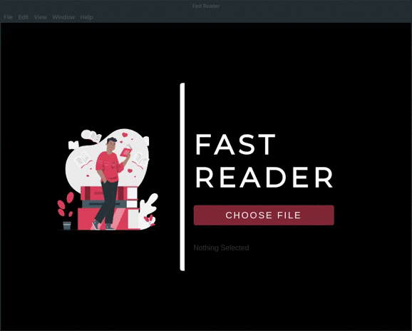

  

<a href="http://www.freepik.com">Designed by slidesgo / Freepik</a>

----

<h5 style="text-align: center;">fast-reader</h1>

<h4 style="text-align: center;">A tool for fast reading pdf docs</h3>

## Contents

- [Contents](#contents)
- [Overview](#overview)
- [Installation](#installation)
- [Shortcuts](#shortcuts)
- [Contributing](#contributing)
- [License](#license)

## Overview

**Following the Rapid Serial Visual Presentation (RSVP) scientific method, this app aims to cut on the time spent reading on your computer.** 

In the era of small screens, traditional reading (i.e. left-to-right, top-to-bottom) is called into question and the RSVP represents one of the main alternatives. RSVP consists of displaying in sequential order one or more words at a time, thus minimizing saccades and eye blinks. 

The app is fully controllable, with buttons and [keyboard shortcuts](#shortcuts), giving the user the freedom to read at his own pace.

## Installation

> `node`, `npm` and `python3` are required to be installed on your system. 

First, `git clone` this repo. Then go to the downloaded folder and run 

`$ npm install`  
to install the dependencies and

`$ npm start`
to start the app

## Shortcuts

Here is the list of keyboard shortcuts:

| Key | Action |
|---|---|
| Space | Play/Pause |
| + | Faster |
| - | Slower |
| Left Arrow | Previous Word |
| Rigth Arrow | Next Word |

There are the corresponding buttons in the interface which also contains some others like:

| Button | Action |
|---|---|
| ^ | Scale Window |
| x | Go to Main Page |
| Progress Bar | Navigate between pages |

## Contributing

**Contributions are all welcome!** 

## License

Licensed under the [MIT license](LICENSE.txt).
